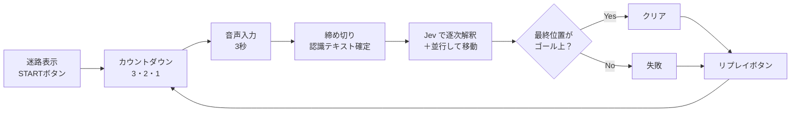
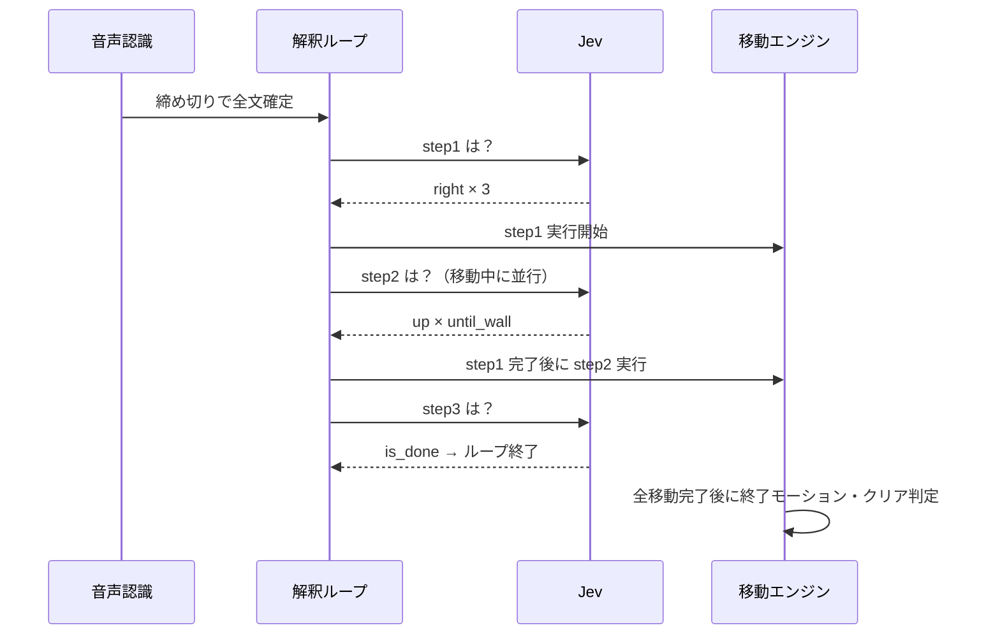

# 音声指示迷路ゲーム 仕様書（Jev活用）

2026-09-24 · @tenkoh

## 概要

俯瞰視点の迷路で、制限時間内の音声指示だけでキャラクターをゴールへ導くブラウザゲーム。Jev が発話を行動列に翻訳し、行動を完了した瞬間にゴール上にいればクリアとなる。

- **面白さ①**：限られた秒数で、自然言語で的確な指示を出せるかというドキドキ
- **面白さ②**：音声入力の締め切りから即座にキャラが動き出す、結果反映の速さ
- **ゲーム条件**：制限時間 3 秒、迷路 5×5 セル、指示は画面上の方向（上下左右）のみで移動。キャラクターに向きの概念はない
- **動作環境**：ブラウザ（入力はマイク音声）、ホスティングは Cloudflare Workers

## ゲームフロー



メイン画面には迷路と START ボタンを表示する。押すと「3」「2」「1」と表示が切り替わるカウントダウンを経て、3 秒間の音声入力が始まる。音声認識は録音開始の 0.5 秒前（カウントダウン「1」の途中）に起動し、発話の冒頭が欠けないようにしつつ、カウントダウン中の周囲の音を拾う時間を短くする。結果表示後はリプレイボタンと別の迷路ボタンを表示する。リプレイは同じ迷路で、別の迷路は事前定義ステージから別のものを選んで、再びカウントダウンから始まる。

判定は「全行動を実行し終えた瞬間の位置」のみで行う。途中でゴールを通過しても、最終位置が違えば失敗とする。

## システム構成

全体を Cloudflare Workers 上で動かす。技術スタックは React + Vite（フロントエンド）と Hono（Workers 上の API）で、ビルドしたフロントエンドは同じ Worker から静的アセットとして配信する。Jev はテキストのみを受け付けるため、音声はブラウザで文字化してから渡し、API キーは Worker のシークレットに保持してブラウザには置かない。

| コンポーネント | 配置・技術 | 役割 |
| --- | --- | --- |
| 迷路・描画・移動エンジン | ブラウザ（React） | 迷路データ保持、移動アニメーション、クリア判定、「突き当たりまで」等の距離計算 |
| 音声認識 | ブラウザ（Web Speech API 想定） | 制限時間中の録音、締め切り時に `stop()` で最終結果を強制確定 |
| 解釈ループ制御 | ブラウザ（React） | 解釈済み行動リストの管理、Jev 呼び出しの繰り返し、終了判定 |
| API プロキシ | Cloudflare Workers（Hono） | API キーをシークレットで保持、TypeSafe API への中継、フロントエンドの静的配信 |
| Jev（jev-latest） | TypeSafe API | 「次の行動」の判断（動作・量・終了） |

## Jev による逐次行動抽出ループ

発話全体が確定してから、「解釈済みリストを踏まえて次の行動は何か」を 1 リクエストずつ繰り返し問う。全文を俯瞰したうえで判断するため、言い直しや順序の入れ替えにも対応しやすい。

**state**（毎回コードが組み立てる）

```json
{
  "utterance": "右に3マス進んで、上に曲がって突き当たりまで、次に右に曲がって2マス",
  "parsed_steps": [
    {"direction": "right", "count": "3"},
    {"direction": "up", "count": "until_wall"}
  ],
  "next_step_number": 3,
  "previous_direction": "up"
}
```

**1 リクエスト内の並列質問**

| 質問 ID | 型 | 内容 | 選択肢 |
| --- | --- | --- | --- |
| next_direction | Choice | `parsed_steps` の次に来る指示の画面上の方向（「曲がる」も画面上の方向として読む） | up / down / left / right / none（指示が尽きた）/ unknown（解釈できない） |
| next_count | Choice | その指示の移動量（距離の指定がなければ until_wall） | 1〜4 / until_wall / until_junction / none / unknown |
| is_done | Noul | `utterance` の指示はすべて `parsed_steps` で網羅済みか | — |

**発話の前処理**：音声認識の結果には読点がほとんど付かない。区切りがないと、後ろの移動の距離が前の移動のものとして読まれたり（「右まっすぐ下 1マス」が 右1マス→下1マス になる）、「右下」が斜めの位置として読まれたりする。そこで Jev に渡す前に、文頭以外の方向の漢字（上下左右）の前に、区切りがなければ読点を入れる（「右まっすぐ、下 1マス」「右、下、右、下」）。画面に表示する発話は元のままとする。

**state の付与ルール**：`next_step_number`（何番目の移動を問うか）と `previous_direction`（直前のステップの方向、なければ null）はコードが決定的に求めて付与する。数える処理を Jev に任せないためである。instructions には次を明記する。

- 方向語は、「曲がる」「右折」などを伴っていても、すべて画面上の方向として読む（「右に曲がって」＝ right）
- 方向語のない「まっすぐ」「そのまま」は `previous_direction` を続ける（null なら unknown）
- 移動は、最初の方向語から 1 番目が始まり、以降は方向語が出るたびに次の移動になる（言い直しを除く）。この区切りのルールは next_direction に書く

**ループの終了条件**（上から順に判定し、最初に該当したもので終了する）

| 優先 | 条件 | 終了の種類 | モーション |
| --- | --- | --- | --- |
| 1 | `is_done` が閾値以上（他の回答と矛盾していても優先） | 完了 | その場で明確に止まる |
| 2 | `next_direction` または `next_count` が none | 完了 | その場で明確に止まる |
| 3 | いずれかが unknown、またはいずれかの confidence が閾値未満（移動量が until_wall のときは閾値を緩める） | 困惑 | 頭上に「？」を出して困る |
| 4 | 最大ステップ数 5 に到達 | 打ち切り | 困惑と同じ |

いずれの終了でも、キューに積んだ移動をすべて実行してから終了モーションに入り、その位置でクリア判定する。困惑の原因となったステップは実行しない。同一 state への再問い合わせは行わない。

```ts
const MAX_STEPS = 5;
const DONE_TH = 0.8;   // 閾値は実データで調整
const CONF_TH = 0.7;
const UNTIL_WALL_CONF_TH = 0.6;  // 移動量が until_wall のときの閾値

type End = 'done' | 'confused' | 'limit';

async function interpret(state): Promise<End> {
  for (let i = 0; i < MAX_STEPS; i++) {
    const a = await askJev(state);
    const dir = a.next_direction, cnt = a.next_count;

    if (a.is_done >= DONE_TH) return 'done';
    if (dir.choice === 'none' || cnt.choice === 'none') return 'done';
    if (dir.choice === 'unknown' || cnt.choice === 'unknown' ||
        dir.confidence < CONF_TH ||
        cnt.confidence < (cnt.choice === 'until_wall' ? UNTIL_WALL_CONF_TH : CONF_TH)) return 'confused';

    const step = { direction: dir.choice, count: cnt.choice };
    state.parsed_steps.push(step);
    enqueueMove(step);
  }
  return 'limit';
}
```

instructions と criteria は英語で記述し、`utterance` のみ日本語のまま渡す。

## 解釈と実行のパイプライン化

ステップ 1 が確定した瞬間に移動を開始し、その移動アニメーション中に次のステップを解釈する。これにより、プレイヤーが待つのは最初の 1 ステップ分だけになる。



表に出る待ち時間は「締め切り → 認識確定 → step1 の解釈」のみ。この間はキャラが考え込む短い演出で間を埋める。1 マスの移動演出は数百 ms とし、解釈が常に移動より先行するよう調整する。

## 設計方針・制約

- **解釈は発話確定後に開始する**：入力中の暫定テキストでは解釈しない。全文を俯瞰した判断を優先する。
- **Jev は忠実な翻訳者に徹する**：迷路の壁・ゴール・正解ルートは state に渡さない。渡すと解釈が迷路に寄り、言い方次第で失敗するゲーム性が損なわれる。
- **出力は画面上の方向のみ**：キャラクターに向きはなく、プレイヤーは画面を見て「右」「下」と指示する。「曲がる」も画面上の方向として扱い、向きの追跡は行わない。方向の値は Jev の選択肢からアプリ内部まで `up / down / left / right` で統一する。
- **判断は Jev、計算はコード**：「突き当たりまで」「次の分かれ道まで」の実距離はコードが迷路データから決定的に計算する。
- **可変長出力はループで表現**：Jev はリストを返せないため、1 回 1 ステップを選択肢から選ばせる。最大ステップ数 5 をコードで強制する。
- **終わり方をプレイヤーに伝える**：「指示を使い切った」完了と「途中で分からなくなった」困惑をモーションで区別し、失敗の原因が言い方にあったと分かるようにする。

## 迷路データ構造

迷路は 5×5 マスのブロック方式で持つ。各マスは「通路」か「壁」のどちらかで、壁はマスそのものを塗りつぶして表現する。React 上の SVG で描画する。「ゴールまでの最少指示数」を計算し、3 秒で言い切れる迷路だけを採用する。

```ts
type Cell = 0 | 1;                // 0 = 通路, 1 = 壁

type Maze = {
  id: string;                     // 事前定義ステージの ID（例: "stage-1"）
  size: 5;
  grid: Cell[][];                 // grid[y][x]
  start: { x: number; y: number };
  goal:  { x: number; y: number };
};

const DIRS = { up: [0, -1], right: [1, 0], down: [0, 1], left: [-1, 0] } as const;

const canEnter = (m: Maze, x: number, y: number) =>
  x >= 0 && y >= 0 && x < m.size && y < m.size && m.grid[y][x] === 0;
```

- **移動計算**：`until_wall` は次のマスが壁ブロックまたは外周になるまで直進。`until_junction` は隣接する通路が 3 つ以上のマスを分岐点と定義して停止する。距離の明示がない指示（「右へ」「まっすぐ」など）は until_wall として扱い、突き当たりまで直進する。数値指定で壁にぶつかる場合は、壁の手前で止まる。
- **ステージ**：PoC では、迷路として成立するステージを事前に定義しておき、ランダムに読み込む。S / G の位置はステージごとに任意。
- **難易度**：（マス, 向き）を状態とする幅優先探索で最少指示数（直進継続コスト 0、方向転換コスト 1）を求める。3 秒で話せるのは 2〜3 指示程度のため、最少指示数 2〜3 の迷路のみ採用する（全ステージについてユニットテストで保証する）。

